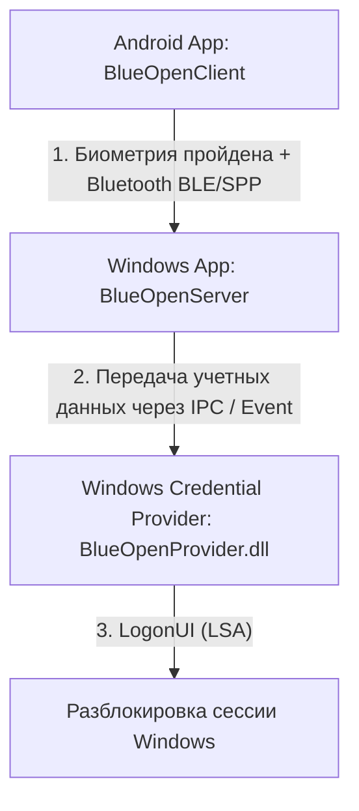

# BlueOpen 🔑📱

**BlueOpen** — это проект с открытым исходным кодом, который позволяет безопасно разблокировать ваш компьютер под управлением Windows с помощью биометрического сканера (отпечатка пальца или Face ID) на вашем Android-смартфоне через Bluetooth.

Проект состоит из трех основных компонентов:
1. **Android Client (`BlueOpenClient`)** — мобильное приложение, отправляющее авторизационный сигнал по Bluetooth.
2. **Windows Server (`BlueOpenServer`)** — фоновое WPF-приложение на C# (.NET 8), которое запущено в сессии пользователя, слушает Bluetooth-команды и координирует процесс разблокировки.
3. **Windows Credential Provider (`BlueOpenProvider`)** — системный модуль аутентификации (DLL на C++), который встраивается в экран блокировки Windows (LogonUI) и выполняет безопасный вход в систему.

---

## Архитектура работы



---

## Требования

- **Смартфон**: Android с поддержкой Bluetooth и сканером отпечатков пальцев / лица.
- **Компьютер**: Windows 10 / 11 64-bit с Bluetooth-адаптером.
- **Для разработки**: 
  - Visual Studio 2022 (с компонентами C++ и .NET 8 SDK).
  - Android Studio / JDK 17 (для сборки APK).
  - Inno Setup 6+ (для сборки установочного пакета).

---

## Сборка компонентов

### 1. Мобильное приложение (`BlueOpenClient`)
Android-клиент написан на Kotlin с использованием Gradle.
* Перейдите в каталог `BlueOpenClient/` и выполните сборку:
  ```bash
  cd BlueOpenClient
  ./gradlew assembleRelease
  ```
  *Готовый APK-файл будет находиться по пути: `BlueOpenClient/app/build/outputs/apk/release/app-release.apk` (или скопирован в корень как `BlueOpenClient.apk`).*

### 2. Фоновый сервис Windows (`BlueOpenServer`)
C#-приложение WPF (.NET 8).
* Откройте проект в Visual Studio или соберите через .NET CLI:
  ```bash
  cd BlueOpenServer
  dotnet build -c Release
  ```
  *Выходные файлы появятся в папке `BlueOpenServer/bin/Release/net8.0-windows10.0.19041.0/`.*

### 3. Credential Provider (`BlueOpenProvider`)
Модуль C++ (DLL).
* Откройте проект C++ в Visual Studio и соберите его под конфигурацию **Release (x64)**.
  *Выходной файл `BlueOpenProvider.dll` скомпилируется в каталог `BlueOpenProvider/bin/x64/Release/`.*

---

## Установка и настройка

Рекомендуется использовать собранный инсталлятор или автоматический скрипт.

### Способ 1: Использование готового инсталлятора (Рекомендуемый)
1. Соберите установочный файл с помощью Inno Setup, скомпилировав файл [blueopen_installer.iss](file:///c:/Users/erch/%D0%9C%D0%BE%D0%B9%20%D0%B4%D0%B8%D1%81%D0%BA/1%20for%20ai/blueopen/blueopen_installer.iss).
2. Запустите полученный файл `BlueOpenSetup.exe` от имени администратора.
3. Следуйте инструкциям мастера установки. Инсталлятор:
   - Скопирует файлы Windows-сервера в `C:\Program Files\BlueOpen`.
   - Установит и зарегистрирует `BlueOpenProvider.dll` в системной папке `C:\Windows\System32`.
   - Внесет необходимые записи в реестр Windows для активации Credential Provider.
   - Настроит автозагрузку сервера при старте Windows.

### Способ 2: Установка через PowerShell-скрипт
1. Откройте PowerShell от имени Администратора.
2. Перейдите в корень проекта и запустите [install_blueopen.ps1](file:///c:/Users/erch/%D0%9C%D0%BE%D0%B9%20%D0%B4%D0%B8%D1%81%D0%BA/1%20for%20ai/blueopen/install_blueopen.ps1):
   ```powershell
   Set-ExecutionPolicy Bypass -Scope Process -Force
   .\install_blueopen.ps1
   ```

### Способ 3: Ручная регистрация (Для разработчиков)
1. Скопируйте скомпилированный `BlueOpenProvider.dll` в `C:\Windows\System32\`.
2. Зарегистрируйте GUID провайдера (`{8a3b8d4f-3c8b-4a5f-9e8a-0c2d3b4a5f6e}`) в реестре по путям:
   - `HKLM\SOFTWARE\Classes\CLSID\{8a3b8d4f-3c8b-4a5f-9e8a-0c2d3b4a5f6e}`
   - `HKLM\SOFTWARE\Microsoft\Windows\CurrentVersion\Authentication\Credential Providers\{8a3b8d4f-3c8b-4a5f-9e8a-0c2d3b4a5f6e}`
3. Добавьте запуск `BlueOpenServer.exe` в ветку `HKLM\SOFTWARE\Microsoft\Windows\CurrentVersion\Run`.

---

## Использование

1. Установите **BlueOpen Client** на свой Android-смартфон.
2. Убедитесь, что на компьютере запущен **BlueOpen Server** (иконка приложения должна отображаться в системном трее Windows).
3. Выполните сопряжение смартфона и компьютера по Bluetooth в настройках Android и Windows.
4. Откройте приложение на телефоне, выберите ваш компьютер в списке Bluetooth-устройств.
5. Заблокируйте компьютер (`Win + L`). На экране входа Windows в левом нижнем углу появится иконка **BlueOpen Credential Provider** (иконка человечка или ключа).
6. Нажмите кнопку разблокировки на смартфоне и подтвердите личность по отпечатку пальца / лицу. Компьютер автоматически разблокируется!

---

## Безопасность и хранение данных

- Обмен данными происходит локально через шифрованное Bluetooth-соединение, исключая передачу ключей через облако или интернет.
- Учетные данные пользователя передаются в системную службу LSA Windows по защищенному внутреннему каналу с использованием стандартных Windows API для провайдеров учетных данных.
